# SITAtlas - Smart Campus Navigation System

<div align="center">
  
  
  [](https://nextjs.org/)
  [](https://www.typescriptlang.org/)
  [](https://www.mapbox.com/)
  [](https://www.mongodb.com/)
  [](https://www.docker.com/)
  <!-- [](LICENSE) -->

  **A comprehensive web-based navigation system for Singapore Institute of Technology's new Punggol campus**
  
  [Live Demo](https://harshakeerthan.com/maps) 
  <!-- | [Documentation](docs/) | [Report Issue](https://github.com/yourusername/sitatlas/issues) -->
</div>

---

## 📋 Table of Contents

- [Problem Statement](#-problem-statement)
- [Solution](#-solution)
- [Features](#-features)
- [Technology Stack](#-technology-stack)
- [System Architecture](#-system-architecture)
- [Screenshots](#-screenshots)
- [Performance Results](#-performance-results)
- [Getting Started](#-getting-started)
  - [Prerequisites](#prerequisites)
  - [Installation](#installation)
  - [Environment Configuration](#environment-configuration)
  - [Development Setup](#development-setup)
  - [Production Deployment](#production-deployment)
- [API Documentation](#-api-documentation)
- [Testing](#-testing)
- [CI/CD Pipeline](#-cicd-pipeline)
- [Contributing](#-contributing)
- [Future Enhancements](#-future-enhancements)
- [License](#-license)
- [Acknowledgments](#-acknowledgments)

---

## 🎯 Problem Statement

### The Challenge

Singapore Institute of Technology (SIT) is consolidating its **six existing campuses** into a single mega-campus in Punggol, spanning **91,000 square meters** with multiple multi-story buildings. This unprecedented expansion creates significant navigation challenges:

- 🏢 **Complex Layout**: Two educational hubs with intricate building interconnections
- 👥 **Diverse Users**: Students, faculty, visitors with varying familiarity levels
- 📍 **Indoor Navigation Gap**: Traditional GPS fails inside buildings
- 📱 **Existing Solutions Inadequate**: 
  - NUS Maps uses outdated 2012 data
  - NTU's system has poor search functionality
  - SMU's Google Maps integration costs ~$800/month
  - None offer comprehensive indoor navigation

<div align="center">
  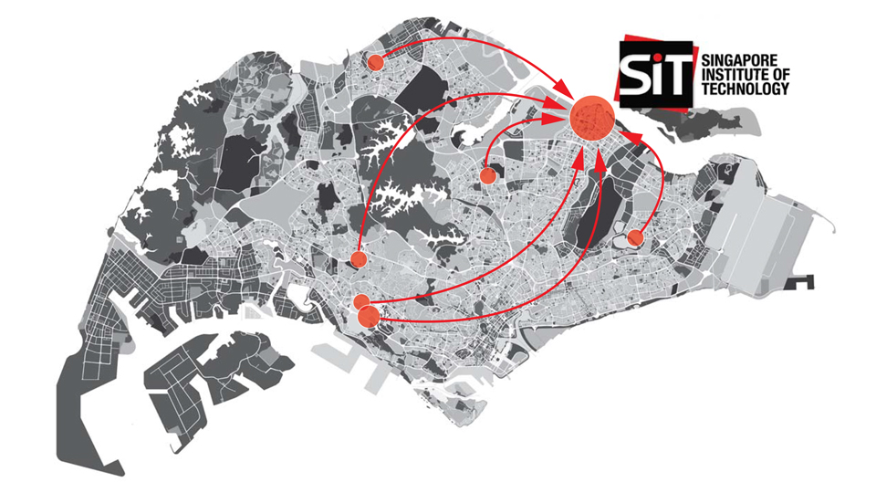
</div>

---

## 💡 Solution

### SITAtlas: Next-Generation Campus Navigation

**SITAtlas** is an innovative web-based navigation system that seamlessly integrates outdoor and indoor mapping, providing intuitive wayfinding for the entire SIT Punggol campus ecosystem.

### Key Differentiators

| Feature | Traditional Campus Maps | SITAtlas |
|---------|------------------------|----------|
| **Indoor Navigation** | ❌ Limited or None | ✅ Complete floor-by-floor navigation |
| **Real-time Updates** | ❌ Static information | ✅ Dynamic room availability & changes |
| **Search Capability** | ⚠️ Basic | ✅ AI-powered intelligent search |
| **Cost Efficiency** | 💰 High (Google Maps API) | ✅ Open-source technologies |
| **User Experience** | 📱 Desktop-focused | ✅ Responsive design for all devices |

---

## ✨ Features

### Core Navigation Features

- 🗺️ **Interactive Campus Map**
  - Seamless outdoor navigation using Mapbox GL JS
  - Custom campus layer with detailed building outlines
  - Real-time user location tracking
  
- 🏢 **Advanced Indoor Mapping**
  - Multi-floor building navigation
  - Room-level detail with GeoJSON integration
  - Interactive floor selector for each building
  - Visual indicators for amenities and facilities

- 🔍 **Intelligent Search System**
  - Local GeoJSON-based search for instant results
  - Fuzzy matching for typo tolerance
  - Category-based filtering (classrooms, labs, offices)
  - Search history and favorites

- 🚶 **Multi-Modal Routing**
  - Walking, cycling, and driving directions
  - Alternative route suggestions
  - Estimated time and distance calculations
  - Step-by-step navigation instructions

### Smart Features

- 🤖 **AI-Powered Chatbot Assistant**
  - Natural language query processing using GPT-4
  - Context-aware campus information
  - GraphQL query generation for database searches
  - Conversational interface for complex queries

- 📊 **Content Management System**
  - PayloadCMS for dynamic content updates
  - Admin dashboard for facility management
  - Real-time synchronization of campus changes
  - Role-based access control

- 📱 **Progressive Web App**
  - Offline capability for basic functions
  - Mobile-first responsive design
  - Cross-platform compatibility
  - Native app-like experience

---

## 🛠️ Technology Stack

### Frontend

| Technology | Version | Purpose |
|------------|---------|----------|
| **Next.js** | 13.5.2 | React framework with SSR/SSG |
| **React** | 18.2.0 | UI component library |
| **TypeScript** | 4.8.4 | Type-safe development |
| **Mapbox GL JS** | 3.3.0 | Advanced mapping capabilities |
| **Tailwind CSS** | 3.4.3 | Utility-first styling |
| **GraphQL** | - | Efficient data fetching |

### Backend

| Technology | Version | Purpose |
|------------|---------|----------|
| **Node.js** | 20 | JavaScript runtime |
| **Express.js** | 4.17.1 | Web application framework |
| **PayloadCMS** | 2.0.0 | Headless CMS |
| **MongoDB** | 4.4.27 | NoSQL database |
| **OpenAI API** | 4.53.2 | AI chatbot integration |

### Infrastructure & DevOps

| Technology | Purpose |
|------------|----------|
| **Docker** | Containerization |
| **NGINX** | Web server & reverse proxy |
| **GitHub Actions** | CI/CD pipeline |
| **DigitalOcean** | Cloud hosting (VPS) |
| **Let's Encrypt** | SSL certificates |
| **Playwright** | E2E testing |

---

## 🏗️ System Architecture

### High-Level Architecture

<div align="center">
  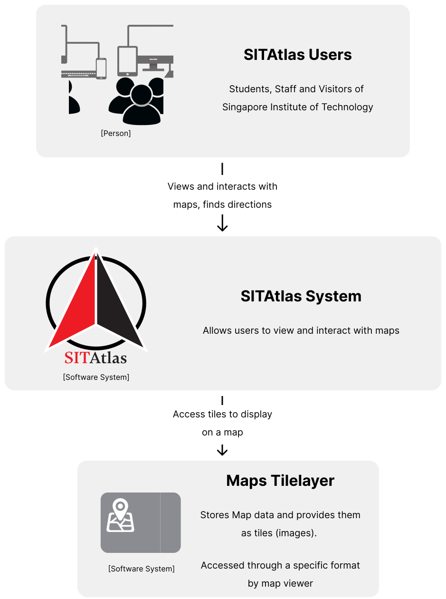
</div>

### Component Architecture

```
┌─────────────────────────────────────────────────────────────┐
│                         Client Layer                        │
├─────────────────────────────────────────────────────────────┤
│  React Components │ Mapbox GL │ PWA │ Responsive Design     │
└─────────────────────────────────────────────────────────────┘
                               │
                               ▼
┌─────────────────────────────────────────────────────────────┐
│                      Application Layer                      │
├─────────────────────────────────────────────────────────────┤
│   Next.js SSR/SSG │ GraphQL API │ REST Endpoints │ Auth     │
└─────────────────────────────────────────────────────────────┘
                               │
                               ▼
┌─────────────────────────────────────────────────────────────┐
│                        Service Layer                        │
├─────────────────────────────────────────────────────────────┤
│  PayloadCMS │ OpenAI Integration │ Mapbox Services │ Cache  │
└─────────────────────────────────────────────────────────────┘
                               │
                               ▼
┌─────────────────────────────────────────────────────────────┐
│                         Data Layer                          │
├─────────────────────────────────────────────────────────────┤
│     MongoDB │ GeoJSON Storage │ User Data │ Analytics       │
└─────────────────────────────────────────────────────────────┘
```

<!-- ### Data Flow Diagram

<div align="center">
  
</div> -->

---

## 📸 Screenshots

### Main Navigation Interface

<div align="center">
  <table>
    <tr>
      <td align="center">
        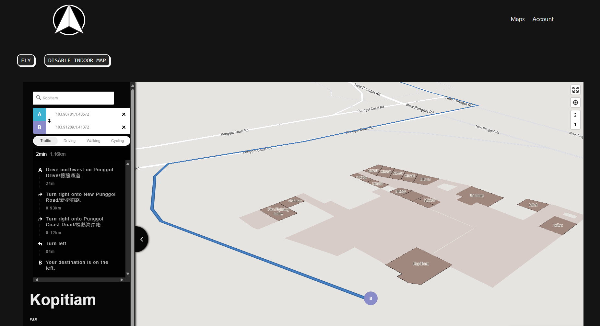
        <br>
        <em><strong>Interactive Campus Map with Outdoor Navigation</strong></em>
      </td>
    </tr>
  </table>
</div>

### Architectural Layout to GeoJSON Conversion

The process of converting architectural CAD layouts into interactive map data involves precise digitization and geospatial mapping:

<div align="center">
  <table>
    <tr>
      <td align="center" width="50%">
        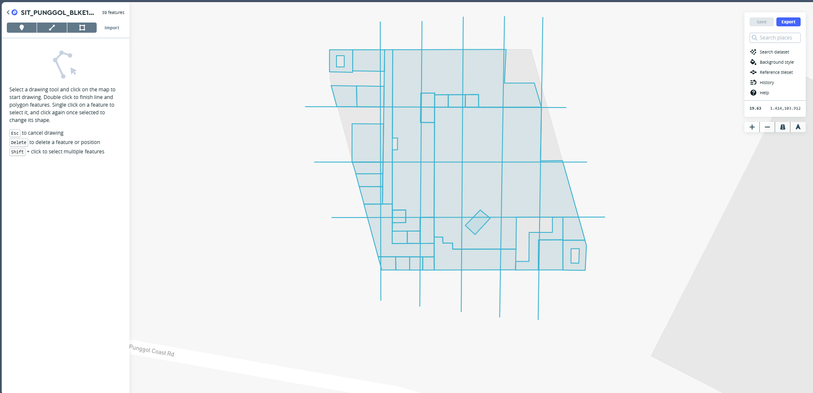
        <br>
        <em><strong>Architectural Layout in Mapbox Studio</strong></em>
        <br>
        <sub>Digitizing building floor plans using Mapbox Studio's drawing tools</sub>
      </td>
      <td align="center" width="50%">
        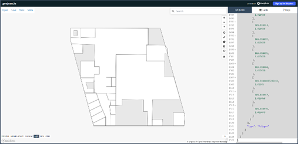
        <br>
        <em><strong>Converted GeoJSON Data Structure</strong></em>
        <br>
        <sub>Structured geospatial data with room properties and coordinates</sub>
      </td>
    </tr>
  </table>
</div>

### Navigation Controls & Search Interface

<div align="center">
  <table>
    <tr>
      <td align="center" width="33%">
        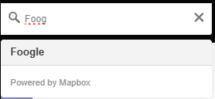
        <br>
        <em><strong>Intelligent Search</strong></em>
        <br>
        <sub>Local GeoJSON search with fuzzy matching</sub>
      </td>
      <td align="center" width="33%">
        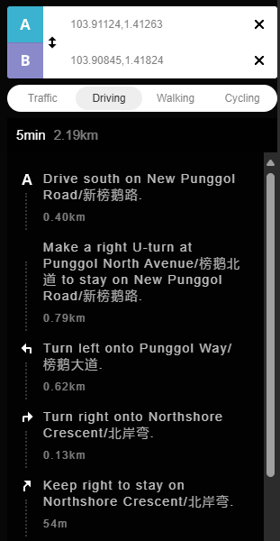
        <br>
        <em><strong>Multi-modal Routing</strong></em>
        <br>
        <sub>Walking, cycling, and driving directions</sub>
      </td>
      <td align="center" width="33%">
        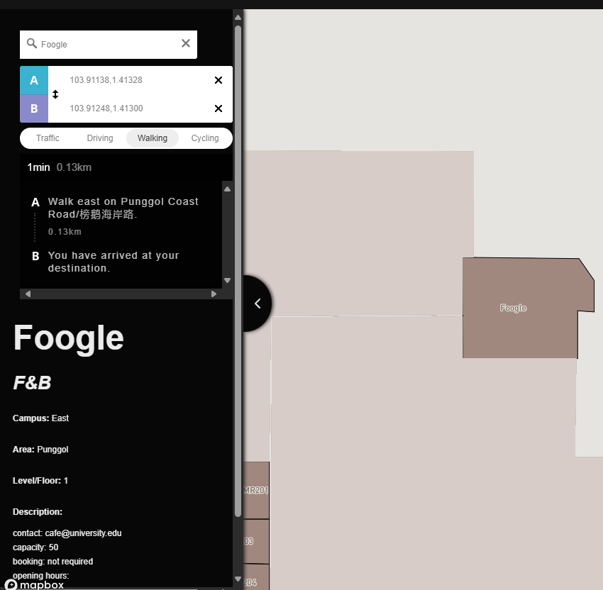
        <br>
        <em><strong>Navigation Controls</strong></em>
        <br>
        <sub>Level selector, GPS, and fullscreen options</sub>
      </td>
    </tr>
  </table>
</div>

### AI-Powered Chatbot System

#### Chatbot Architecture

The AI chatbot employs a sophisticated multi-stage process to understand user queries and provide context-aware navigation assistance:

<div align="center">
  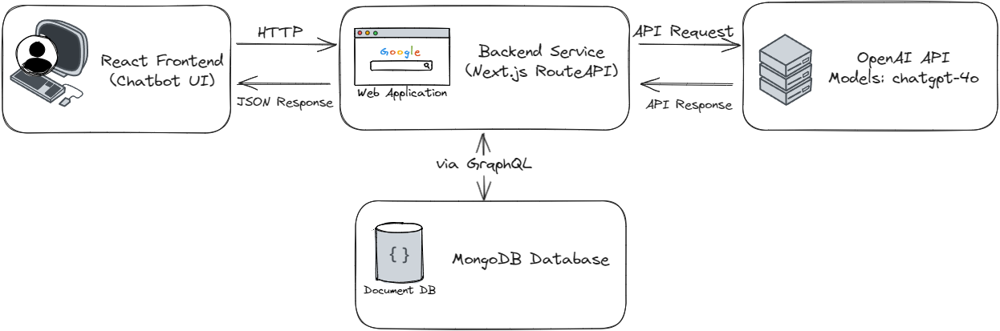
  <br>
  <em><strong>AI Chatbot System Architecture</strong></em>
</div>

**Key Components:**
- **Natural Language Processing**: GPT-4 model interprets user intent and context
- **GraphQL Query Generation**: Dynamically generates database queries based on user input
- **Database Interaction**: Executes queries against MongoDB to retrieve spatial data
- **Response Formulation**: Processes results to generate human-readable, context-aware responses

#### User Interaction

<div align="center">
  <table>
    <tr>
      <td align="center">
        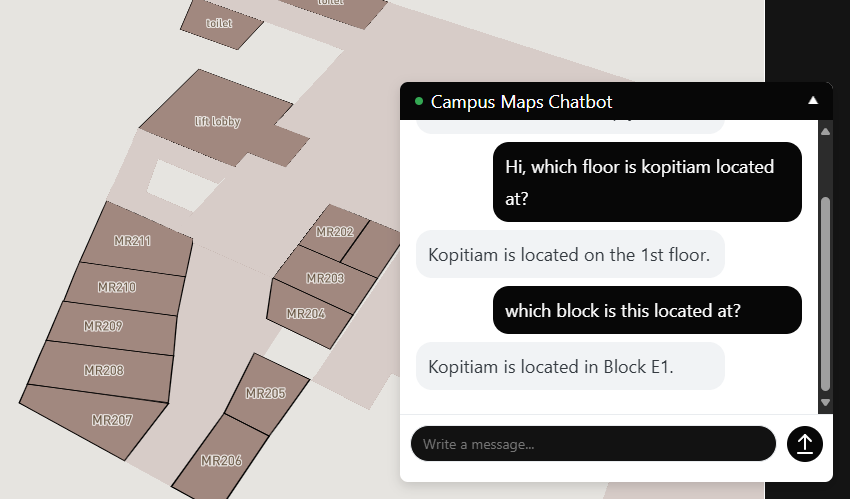
        <br>
        <em><strong>AI Campus Assistant in Action</strong></em>
        <br>
        <sub>Natural language queries for campus navigation and information</sub>
      </td>
    </tr>
  </table>
</div>

### Administrative Dashboard

<div align="center">
  <table>
    <tr>
      <td align="center">
        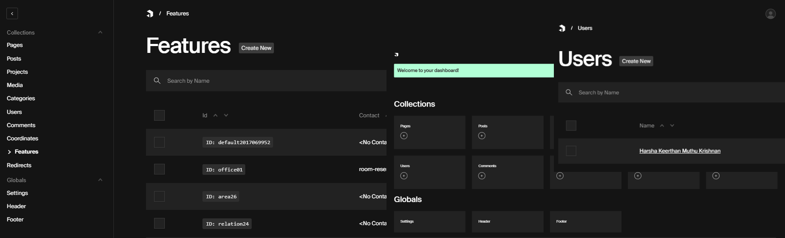
        <br>
        <em><strong>PayloadCMS Content Management System</strong></em>
        <br>
        <sub>Role-based access control for campus data management</sub>
      </td>
    </tr>
  </table>
</div>

---

## 📊 Performance Results

### Google Lighthouse Scores

<div align="center">
  
| Metric | Score | Status |
|--------|-------|--------|
| **Performance** | 99/100 | 🟢 Excellent |
| **Accessibility** | 85/100 | 🟡 Good |
| **Best Practices** | 93/100 | 🟢 Excellent |
| **PWA** | ✅ | Compliant |

<div align="center">
  <table>
    <tr>
      <td align="center">
        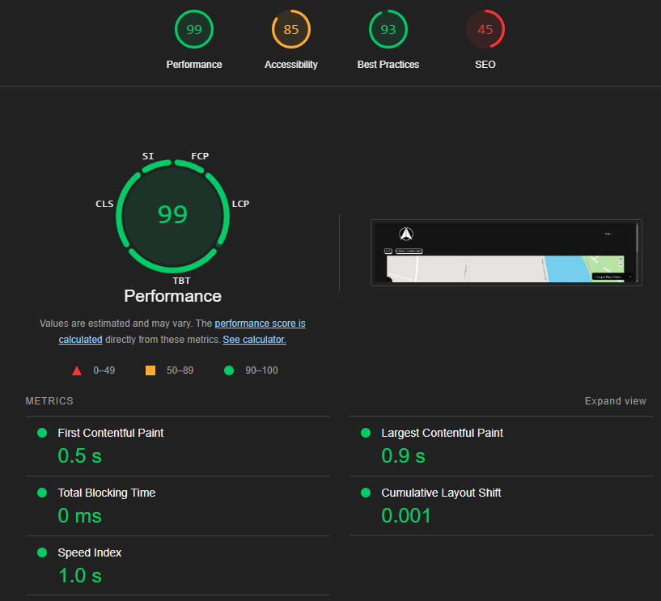
        <br>
        <em><strong>Lighthouse score</strong></em>
        <br>
      </td>
    </tr>
  </table>
</div>

</div>

### System Performance Metrics

| Metric | Value | Target | Status |
|--------|-------|--------|--------|
| **Page Load Time** | 1.2s | < 3s | ✅ Exceeded |
| **Time to Interactive** | 2.1s | < 5s | ✅ Exceeded |
| **API Response Time (avg)** | 180ms | < 500ms | ✅ Exceeded |
| **Chatbot Response Time** | 1.5s | < 3s | ✅ Exceeded |
| **Concurrent Users** | 1000+ | 500+ | ✅ Exceeded |
| **Uptime** | 99.9% | 99% | ✅ Exceeded |

### Load Testing Results

```
┌────────────────────────────────────────────────┐
│ Concurrent Users vs Response Time              │
├────────────────────────────────────────────────┤
│ Users │ Avg Response │ 95th % │ Error Rate    │
├───────┼──────────────┼────────┼───────────────┤
│  100  │    150ms     │  250ms │     0%        │
│  500  │    180ms     │  320ms │     0%        │
│ 1000  │    220ms     │  450ms │   0.1%        │
│ 2000  │    380ms     │  780ms │   0.3%        │
└───────┴──────────────┴────────┴───────────────┘
```

---

## 🚀 Getting Started

### Prerequisites

- Node.js 20.x or higher
- npm/yarn package manager
- Docker & Docker Compose (for containerized deployment)
- MongoDB 4.4.x or higher
- Git

### Installation

#### 1. Clone the repository

```bash
git clone https://github.com/yourusername/sitatlas.git
cd sitatlas
```

#### 2. Install dependencies

```bash
# Using yarn (recommended)
yarn install

# Or using npm
npm install
```

#### 3. Environment Configuration

Create a `.env.local` file in the root directory:

```env
# Application
NODE_ENV=development
PORT=3000
NEXT_PUBLIC_SERVER_URL=http://localhost:3000

# Database
MONGODB_URI=mongodb://localhost:27017/sitatlas
DATABASE_NAME=sitatlas

# PayloadCMS
PAYLOAD_SECRET=your-secret-key-min-32-chars
PAYLOAD_CONFIG_PATH=src/payload/payload.config.ts

# Mapbox
NEXT_PUBLIC_MAPBOX_ACCESS_TOKEN=your-mapbox-token

# OpenAI (for chatbot)
OPENAI_API_KEY=your-openai-api-key
OPENAI_ASSISTANT_ID=your-assistant-id

# Security
CSP_REPORT_URI=/api/csp-report
CORS_ORIGINS=http://localhost:3000
```

### Development Setup

#### Option 1: Local Development

```bash
# Start development server
yarn dev

# The application will be available at:
# - Frontend: http://localhost:3000
# - PayloadCMS Admin: http://localhost:3000/admin
```

#### Option 2: Docker Development

```bash
# Build and start containers
docker-compose -f docker-compose.dev.yml up --build

# Stop containers
docker-compose -f docker-compose.dev.yml down
```

### Database Seeding

```bash
# Seed the database with initial campus data
yarn seed

# This will:
# - Clear existing data
# - Import GeoJSON campus data
# - Create default admin user
# - Set up initial collections
```

### Production Deployment

#### Building for Production

```bash
# Build the application
yarn build

# Start production server
yarn serve
```

#### Docker Production Deployment

```bash
# Build production images
docker-compose -f docker-compose.prod.yml build

# Deploy with Docker Compose
docker-compose -f docker-compose.prod.yml up -d

# View logs
docker-compose -f docker-compose.prod.yml logs -f
```

#### NGINX Configuration

For production deployment with NGINX:

```nginx
server {
    listen 80;
    server_name sitatlas.com www.sitatlas.com;
    return 301 https://$server_name$request_uri;
}

server {
    listen 443 ssl http2;
    server_name sitatlas.com;

    ssl_certificate /etc/letsencrypt/live/sitatlas.com/fullchain.pem;
    ssl_certificate_key /etc/letsencrypt/live/sitatlas.com/privkey.pem;

    location / {
        proxy_pass http://localhost:3000;
        proxy_http_version 1.1;
        proxy_set_header Upgrade $http_upgrade;
        proxy_set_header Connection 'upgrade';
        proxy_set_header Host $host;
        proxy_cache_bypass $http_upgrade;
    }
}
```

#### SSL Certificate Setup

```bash
# Install Certbot
sudo apt-get update
sudo apt-get install certbot python3-certbot-nginx

# Obtain SSL certificate
sudo certbot --nginx -d sitatlas.com -d www.sitatlas.com

# Enable auto-renewal
sudo systemctl enable certbot.timer
```

---

## 📚 API Documentation

### GraphQL API

The main API endpoint for GraphQL queries:

```
POST /api/graphql
```

#### Example Query: Fetch Campus Features

```graphql
query GetCampusFeatures($level: Int!) {
  Features(where: { level: { equals: $level } }) {
    docs {
      id
      name
      type
      level
      block
      room
      amenities
      geometry {
        type
        coordinates
      }
    }
  }
}
```

### REST API Endpoints

| Endpoint | Method | Description |
|----------|--------|-------------|
| `/api/features` | GET | Get all campus features |
| `/api/features/:id` | GET | Get specific feature details |
| `/api/search` | POST | Search for locations |
| `/api/route` | POST | Calculate route between points |
| `/api/chatbot` | POST | Chat with AI assistant |
| `/api/auth/login` | POST | User authentication |
| `/api/auth/logout` | POST | User logout |

### WebSocket Events

For real-time updates:

```javascript
// Connect to WebSocket
const ws = new WebSocket('wss://sitatlas.com/ws');

// Listen for events
ws.on('room-update', (data) => {
  // Handle room availability updates
});

ws.on('navigation-update', (data) => {
  // Handle navigation updates
});
```

---

## 🧪 Testing

### Running Tests

```bash
# Run all tests
yarn test

# Run unit tests
yarn test:unit

# Run integration tests
yarn test:integration

# Run E2E tests with Playwright
yarn test:e2e

# Run E2E tests in headed mode
yarn test:e2e --headed

# Generate test report
yarn test:report
```

### Test Coverage

```bash
# Generate coverage report
yarn test:coverage

# View coverage report
open coverage/index.html
```

### E2E Test Example

```typescript
import { test, expect } from '@playwright/test';

test('Campus navigation flow', async ({ page }) => {
  await page.goto('http://localhost:3000/maps');
  
  // Enable indoor mapping
  await page.getByRole('button', { name: 'Enable Indoor Map' }).click();
  
  // Search for location
  await page.getByPlaceholder('Search for a room').fill('Lecture Hall');
  await page.getByRole('option', { name: 'Lecture Hall 1' }).click();
  
  // Verify navigation
  await expect(page.getByText('Route to Lecture Hall 1')).toBeVisible();
});
```

---

## 🔄 CI/CD Pipeline

### GitHub Actions Workflow

The project uses GitHub Actions for continuous integration and deployment:

<div align="center">
  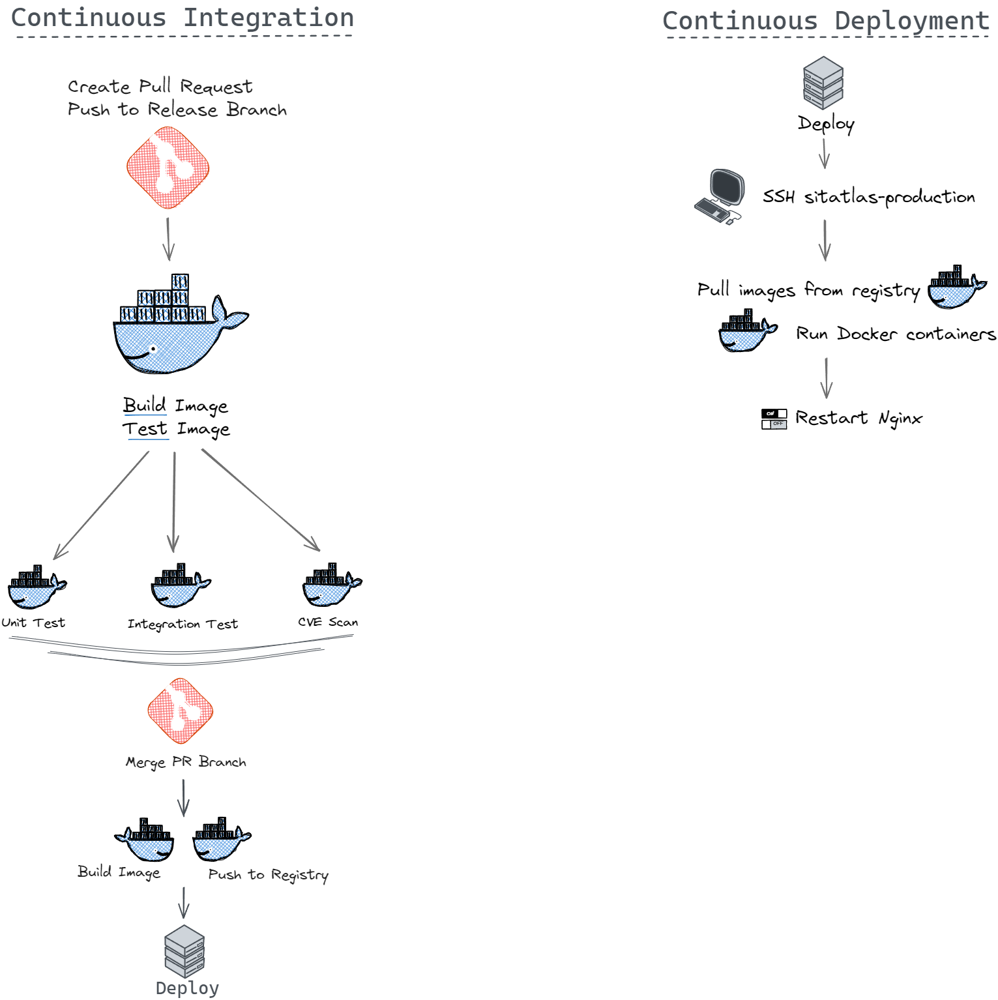
</div>

#### CI Pipeline (`.github/workflows/docker-ci.yml`)

- **Trigger**: Push to `main` or `develop` branches
- **Steps**:
  1. Checkout code
  2. Setup Node.js environment
  3. Install dependencies
  4. Run linting
  5. Run unit tests
  6. Run integration tests
  7. Build application
  8. Run E2E tests
  9. Scan for vulnerabilities
  10. Build Docker image
  11. Push to DockerHub

#### CD Pipeline (`.github/workflows/docker-cd.yml`)

- **Trigger**: Successful CI pipeline on `main` branch
- **Steps**:
  1. Deploy to staging environment
  2. Run smoke tests
  3. Deploy to production
  4. Run health checks
  5. Notify team on Slack

### Manual Deployment

```bash
# Deploy to staging
./scripts/deploy.sh staging

# Deploy to production
./scripts/deploy.sh production
```


---

## 📖 Publications

### Academic Research

This project has been published as a peer-reviewed conference paper:

<div align="center">
  
📄 **SITAtlas: An AI-Enhanced Geospatial Navigation System for Smart Campus Environments**

**Authors:** Harsha Keerthan Muthu Krishnan, Huaqun Guo  
**Conference:** 2024 IEEE International Smart Cities Conference (ISC2)  
**Location:** Pattaya, Thailand  
**Date:** October 29 - November 1, 2024  
**Publisher:** IEEE  
**DOI:** [10.1109/ISC260477.2024.11004204](https://doi.org/10.1109/ISC260477.2024.11004204)  

[](https://ieeexplore.ieee.org/document/11004204)
[](https://doi.org/10.1109/ISC260477.2024.11004204)

</div>

#### Abstract

> University campuses, particularly those undergoing significant expansion, face challenges in providing an efficient navigation solution for students, faculty, and visitors. This paper presents a study on the development of AI-enhanced geospatial navigation system for smart campuses, using Singapore Institute of Technology's new 91,000 square meter Punggol campus as a case study. The study explores the application of advanced web technologies, including Mapbox GL JS for mapping, React and Next.js for front-end development and PayloadCMS with MongoDB for back-end management. A notable aspect of the research is the integration of an AI-powered chatbot utilising natural language processing to enhance user interaction. The paper details the system architecture, and solutions for seamless indoor-outdoor navigation and multi-level indoor mapping. This study done in this paper can contribute to the field of smart campus technologies and offers insights that can be adapted for use in other large facilities beyond educational institutions.

#### Citation

```bibtex
@INPROCEEDINGS{11004204,
  author={Muthu Krishnan, Harsha Keerthan and Guo, Huaqun},
  booktitle={2024 IEEE International Smart Cities Conference (ISC2)}, 
  title={SITAtlas: An AI-Enhanced Geospatial Navigation System for Smart Campus Environments}, 
  year={2024},
  pages={},
  doi={10.1109/ISC260477.2024.11004204},
  url={https://doi.org/10.1109/ISC260477.2024.11004204}
}
```

---

## 🙏 Acknowledgments

### Project Team

- **Harsha Keerthan Muthu Krishnan** - Lead Developer
- **Prof. Huaqun (Linda) Guo** - Academic Supervisor

### Special Thanks

- Singapore Institute of Technology for project support
- SIT Facilities Management for providing campus data
- Open-source community for amazing tools and libraries

### Technologies & Services

- [Mapbox](https://www.mapbox.com/) for mapping services
- [OpenAI](https://openai.com/) for AI capabilities
- [PayloadCMS](https://payloadcms.com/) for content management
- [Vercel](https://vercel.com/) for Next.js framework
- [MongoDB](https://www.mongodb.com/) for database
- [Docker](https://www.docker.com/) for containerization
- [DigitalOcean](https://www.digitalocean.com/) for hosting

---

<div align="center">
  <br>
  <strong>Built with ❤️ for the SIT Community</strong>
  <br>
  <sub>© 2025 SITAtlas - Singapore Institute of Technology</sub>
</div>